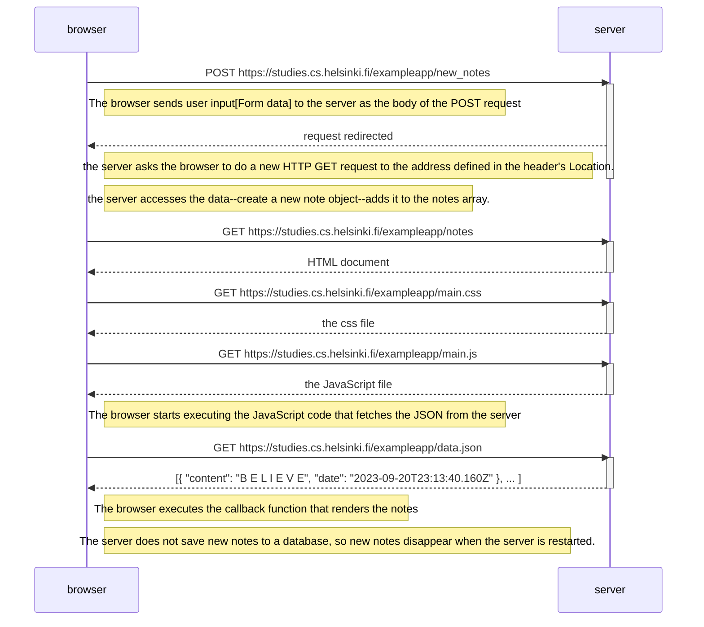

# 0.4

```mermaid
sequenceDiagram
    participant browser
    participant server

    browser->>server: POST https://studies.cs.helsinki.fi/exampleapp/new_notes
    activate server
    Note right of browser: The browser sends user input[Form data] to the server as the body of the POST request
    server-->>browser: request redirected
    Note right of browser:the server asks the browser to do a new HTTP GET request to the address defined in the header's Location.
    deactivate server
    Note right of browser:the server accesses the data--create a new note object--adds it to the notes array.

    browser->>server: GET https://studies.cs.helsinki.fi/exampleapp/notes
    activate server
    server-->>browser: HTML document
    deactivate server

    browser->>server: GET https://studies.cs.helsinki.fi/exampleapp/main.css
    activate server
    server-->>browser: the css file
    deactivate server

    browser->>server: GET https://studies.cs.helsinki.fi/exampleapp/main.js
    activate server
    server-->>browser: the JavaScript file
    deactivate server

    Note right of browser: The browser starts executing the JavaScript code that fetches the JSON from the server

    browser->>server: GET https://studies.cs.helsinki.fi/exampleapp/data.json
    activate server
    server-->>browser: [{ "content": "B E L I E V E", "date": "2023-09-20T23:13:40.160Z" }, ... ]
    deactivate server

    Note right of browser: The browser executes the callback function that renders the notes
    note right of browser: The server does not save new notes to a database, so new notes disappear when the server is restarted.

```
