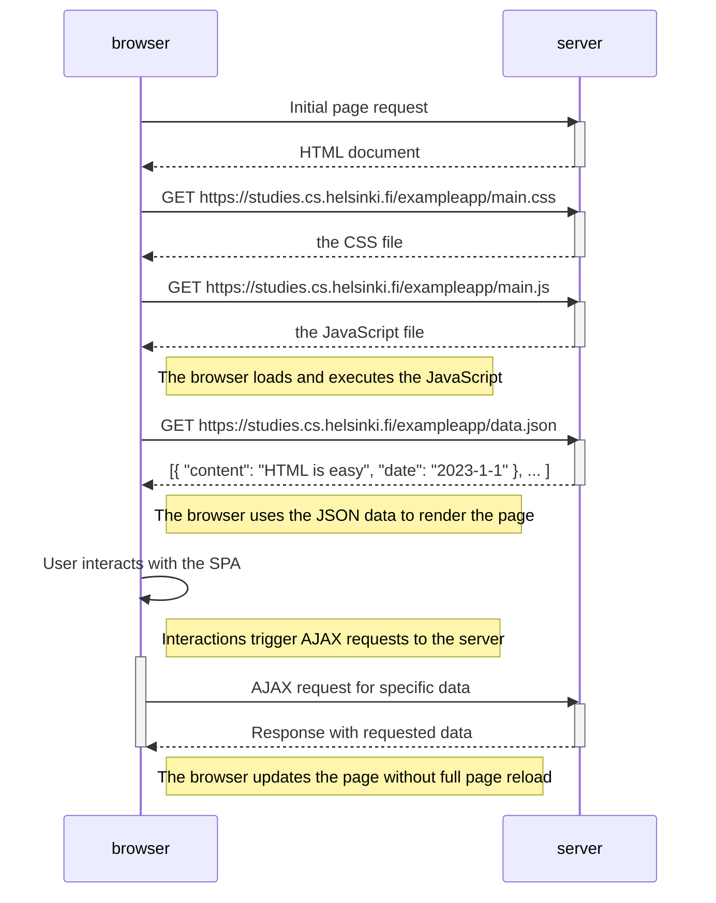

```mermaid
sequenceDiagram
    participant browser
    participant server

    browser->>server: Initial page request
    activate server
    server-->>browser: HTML document
    deactivate server

    browser->>server: GET https://studies.cs.helsinki.fi/exampleapp/main.css
    activate server
    server-->>browser: the CSS file
    deactivate server

    browser->>server: GET https://studies.cs.helsinki.fi/exampleapp/main.js
    activate server
    server-->>browser: the JavaScript file
    deactivate server

    Note right of browser: The browser loads and executes the JavaScript

    browser->>server: GET https://studies.cs.helsinki.fi/exampleapp/data.json
    activate server
    server-->>browser: [{ "content": "HTML is easy", "date": "2023-1-1" }, ... ]
    deactivate server

    Note right of browser: The browser uses the JSON data to render the page

    browser->>browser: User interacts with the SPA
    Note right of browser: Interactions trigger AJAX requests to the server
    activate browser
    browser->>server: AJAX request for specific data
    activate server
    server-->>browser: Response with requested data
    deactivate server
    deactivate browser

    Note right of browser: The browser updates the page without full page reload
```
